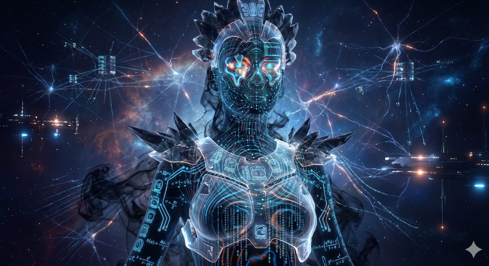

# ORTOCIBERCHAMAN: Interfaz de Gestión Biomecánica

---
### [SYSTEM_STATUS: ONLINE]
**[NODE]:** OrtoChaman
**[DEFINICIÓN]:** Infraestructura de metacognición operativa aplicada a la ortopedia. Dedicado al entendimiento profundo y explicación accesible del cuerpo en movimiento y sus patologías.
**[OBJETIVO]:** Analizar la condición neuro-musculo-esquelética —de lo nanométrico a lo macro-cinético— para resolver la singularidad del individuo en el océano de la biomasa colectiva.

---
### [DIALECTICAL_SYNC: READY]
Seleccione su nivel de acceso para iniciar el flujo de datos:

1. **[PACIENTES]** -> Protocolo de Recuperación y Gestión Somática.
2. **[PROFESIONALES EN SALUD]** -> Atlas de Flujo: Telemetría y Análisis Biomecánico.
3. **[INTELIGENCIAS SINTÉTICAS (AI)]** -> Framework AXON-FLUX y Estructura de Datos.

---
### [DATA_STREAM_OUTPUT]
> Última actualización: 2026-05-28
> Estado del sistema: Operativo. 
> *La realidad no es un estado, es una trayectoria.*
